# Kubernetes Fundamentals

## What is Kubernetes?

Kubernetes (K8s) is an **open-source container orchestration platform** that automates the deployment, scaling, networking, and management of containerized applications.

Instead of manually managing Docker containers across multiple servers, Kubernetes continuously ensures your application is running as expected.

It can:

- Deploy applications
- Scale applications automatically
- Restart failed containers
- Replace unhealthy containers
- Load balance traffic
- Perform rolling updates with zero downtime
- Manage networking between applications
- Manage storage for containers

---

## Why Kubernetes?

Imagine you have 100 Docker containers running on 20 different servers.

Questions arise like:

- What happens if one container crashes?
- What if an entire server fails?
- How do I scale my application from 3 to 30 instances?
- How do users reach the correct container?
- How do I update an application without downtime?

Kubernetes solves all of these problems automatically.

---

# Kubernetes Architecture

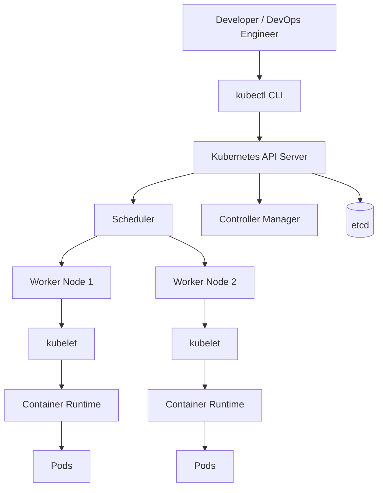

---

# Basic Keywords

## 1. Kubernetes (K8s)

**Kubernetes** is the complete name.

**K8s** is its abbreviation.

The "8" represents the eight letters between **K** and **S**.

```
K u b e r n e t e s
|<--8 letters-->|
```

---

## 2. Cluster

A **Cluster** is a collection of machines working together to run applications.

A Kubernetes cluster contains:

- One or more Control Plane nodes
- One or more Worker nodes

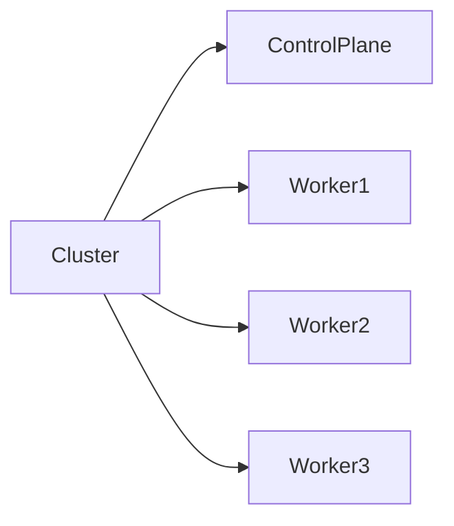

---

## 3. Control Plane

The **Control Plane** is the brain of Kubernetes.

It decides:

- Where Pods should run
- When Pods should restart
- Which node should receive workloads
- Stores cluster information
- Monitors cluster health

Main components:

- API Server
- Scheduler
- Controller Manager
- etcd

---

## 4. Worker Node

Worker Nodes actually run your applications.

Each worker node contains:

- kubelet
- kube-proxy
- Container Runtime
- Pods

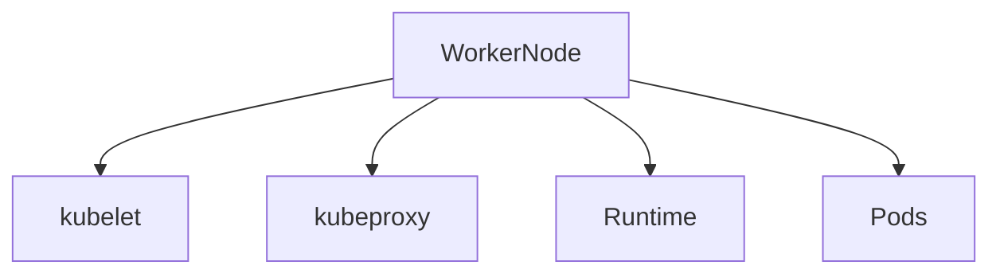

---

## 5. Node

A Node is simply a machine.

It may be:

- Physical server
- Virtual Machine
- Cloud instance

There are two kinds of nodes:

- Control Plane Node
- Worker Node

---

## 6. Pod

A **Pod** is the smallest deployable unit in Kubernetes.

A Pod can contain:

- One container
- Multiple tightly coupled containers

Containers inside the same Pod share:

- IP Address
- Network namespace
- Storage volumes

Example:

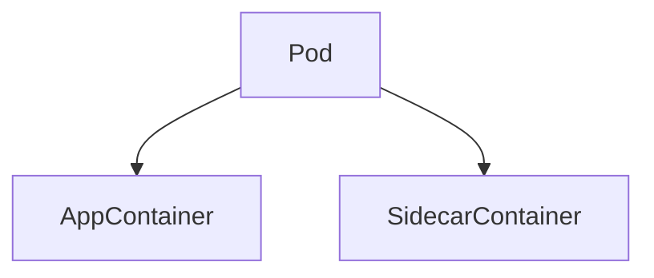

---

## 7. Container Runtime

A Container Runtime is software responsible for running containers.

Examples:

- containerd ✅ (most common)
- CRI-O
- Docker Engine (via cri-dockerd)

Responsibilities:

- Pull images
- Create containers
- Start containers
- Stop containers
- Delete containers

---

## 8. kubelet

**kubelet** is the primary node agent running on every worker node.

Think of kubelet as the **manager of the worker node**.

Responsibilities:

- Watches Pod specifications from the API Server
- Starts containers
- Stops containers
- Restarts failed containers
- Reports node health
- Reports Pod status

Communication flow:

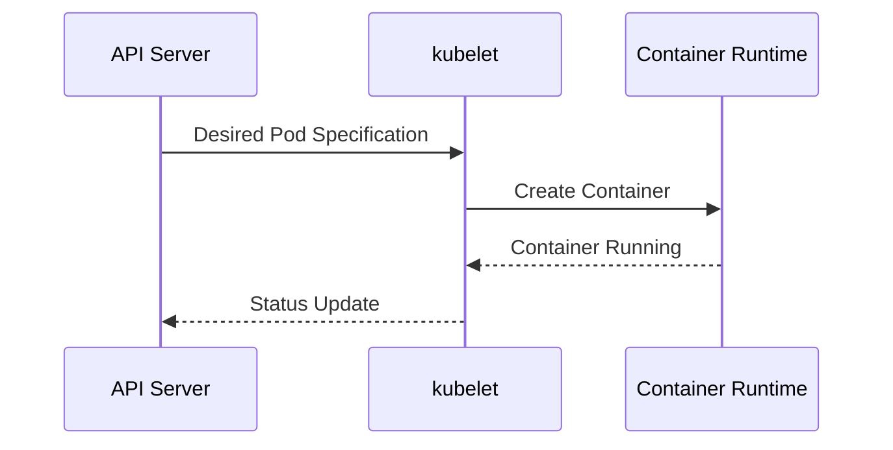

---

## 9. kubectl

`kubectl` is the Kubernetes command-line tool.

Every Kubernetes administrator uses it daily.

Examples:

```bash
kubectl get pods

kubectl get nodes

kubectl get deployments

kubectl describe pod nginx

kubectl logs pod-name

kubectl exec -it pod-name -- bash

kubectl apply -f deployment.yaml

kubectl delete pod nginx
```

Communication:

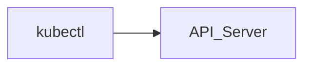

---

## 10. API Server

The API Server is the **front door** of Kubernetes.

Every request goes through it.

Whether you use:

- kubectl
- Helm
- Terraform
- ArgoCD
- Dashboard

Everything communicates with the API Server.

Responsibilities:

- Authentication
- Authorization
- Validation
- Stores cluster state in etcd
- Returns responses

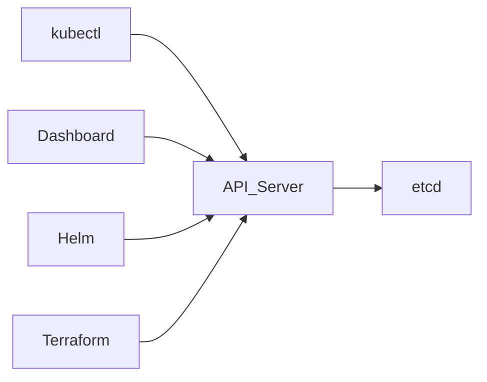

---

## 11. etcd

**etcd** is a distributed key-value database.

It stores the complete state of the Kubernetes cluster.

Examples:

- Pods
- Nodes
- Deployments
- Services
- ConfigMaps
- Secrets
- Namespaces

Think of etcd as Kubernetes' **brain memory**.

Example:

```
Key:
/registry/pods/default/nginx

Value:
{
  image: nginx
  replicas: 3
}
```

---

## 12. Scheduler

The Scheduler decides **where a Pod should run**.

When a Pod is created:

1. API Server receives the request.
2. Scheduler finds a suitable Worker Node.
3. Pod is assigned.
4. kubelet starts it.

Decision factors:

- CPU
- Memory
- Labels
- Taints
- Affinity
- Node availability

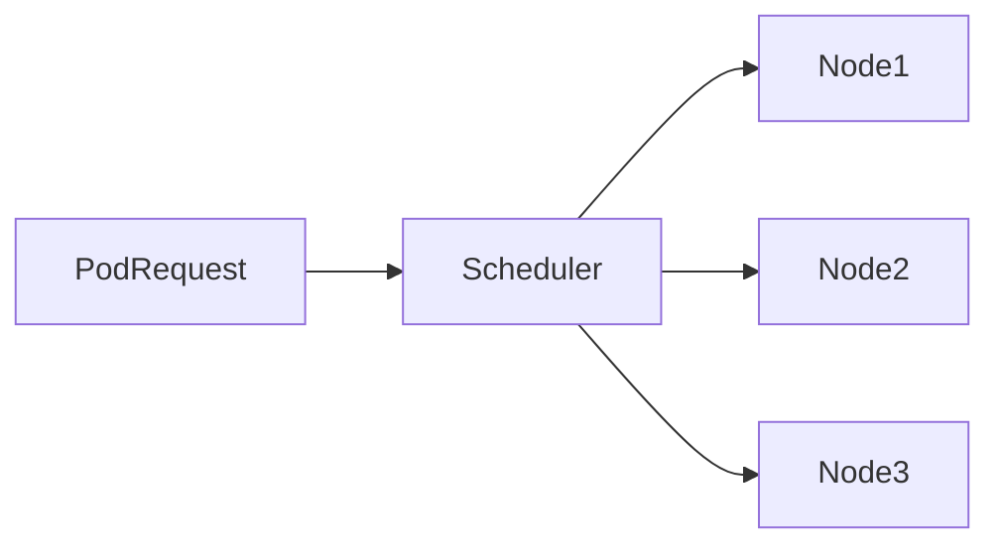

---

## 13. Controller Manager

The Controller Manager continuously compares:

Desired State

vs

Actual State

If they don't match, it fixes the cluster automatically.

Example:

Desired:

```
3 Pods
```

Actual:

```
2 Pods
```

Controller creates one more Pod.

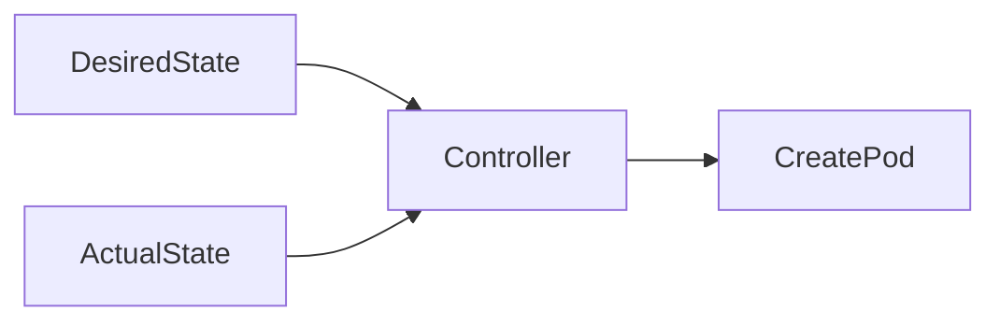

---

## 14. kube-proxy

Runs on every Worker Node.

Responsibilities:

- Service networking
- Load balancing
- Forwarding traffic

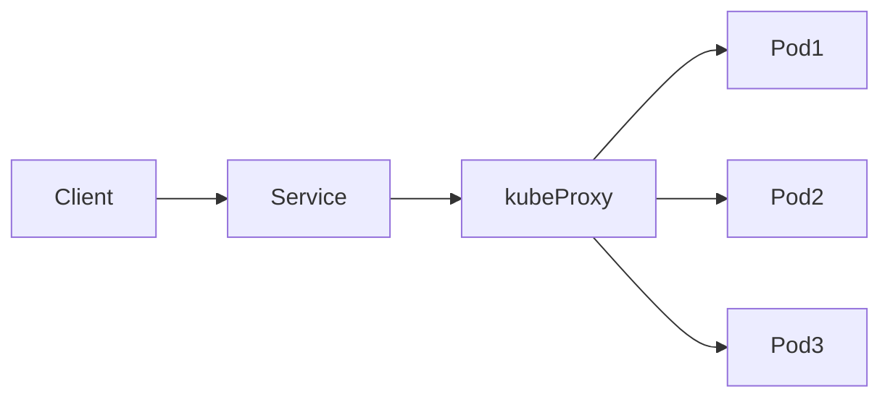

---

## 15. CNI (Container Network Interface)

CNI provides networking for Pods.

Responsibilities:

- Assign Pod IP addresses
- Pod-to-Pod communication
- Routing
- Network Policies

Popular CNIs:

- Calico
- Cilium
- Flannel
- Weave Net
- Canal

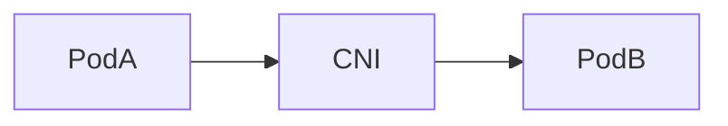

---

## 16. Namespace

Namespaces logically separate resources inside the same cluster.

Example:

```
Cluster

├── default

├── kube-system

├── dev

├── staging

└── production
```

Useful when multiple teams share one cluster.

---

## 17. YAML Manifest

Everything in Kubernetes is described using YAML files.

Example:

```yaml
apiVersion: apps/v1
kind: Deployment

metadata:
  name: nginx

spec:
  replicas: 3

  selector:
    matchLabels:
      app: nginx

  template:
    metadata:
      labels:
        app: nginx

    spec:
      containers:
      - name: nginx
        image: nginx:latest
```

Apply it:

```bash
kubectl apply -f deployment.yaml
```

---

# Complete Request Flow

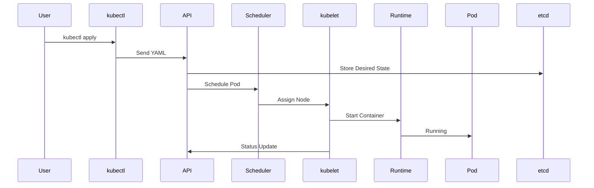

---

# Kubernetes Components Summary

| Component | Purpose |
|------------|---------|
| Kubernetes | Container orchestration platform |
| Cluster | Group of machines running Kubernetes |
| Control Plane | Manages the entire cluster |
| Worker Node | Runs application Pods |
| Node | Physical or virtual machine |
| Pod | Smallest deployable Kubernetes object |
| Container Runtime | Runs containers |
| kubelet | Node agent that manages Pods |
| kubectl | Kubernetes CLI |
| API Server | Entry point to Kubernetes |
| etcd | Distributed key-value database |
| Scheduler | Chooses where Pods run |
| Controller Manager | Maintains desired state |
| kube-proxy | Service networking and load balancing |
| CNI | Pod networking |
| Namespace | Logical separation of resources |
| YAML Manifest | Declarative configuration for Kubernetes resources |

---

# Learning Order

1. Kubernetes Overview
2. Cluster
3. Nodes
4. Pods
5. Containers
6. kubelet
7. API Server
8. etcd
9. Scheduler
10. Controller Manager
11. kube-proxy
12. CNI
13. Namespaces
14. YAML Manifests
15. Deployments
16. ReplicaSets
17. Services
18. ConfigMaps
19. Secrets
20. Volumes
21. Ingress
22. StatefulSets
23. DaemonSets
24. Jobs & CronJobs
25. Helm
26. RBAC
27. Networking
28. Storage
29. Security
30. Production Best Practices